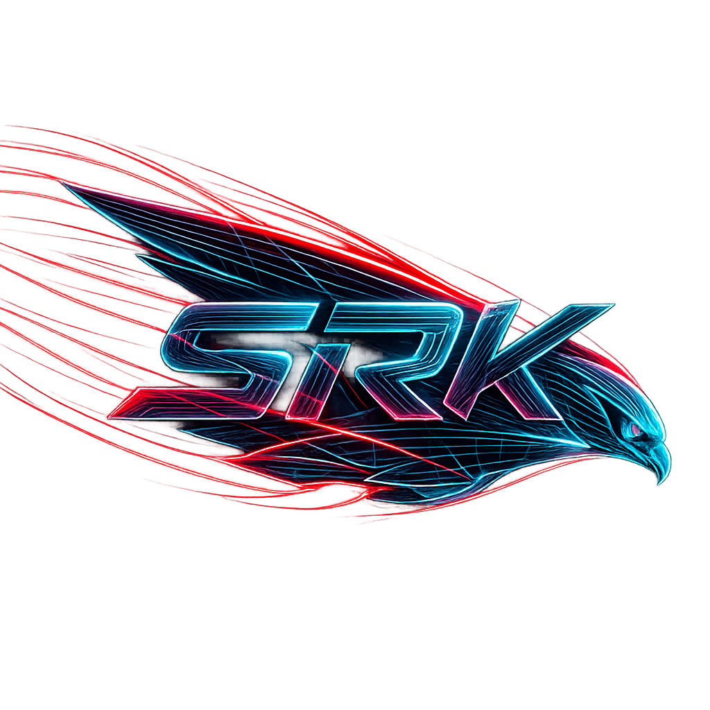

  

# SRK Automotive

## 🛠️ The Mission
SRK Automotive is a multidisciplinary engineering collective focused on the intersection of **High-Frequency Mechanical Performance** and **Modern Digital Telemetry**. We build cars that rev to the moon and the software required to prove they're doing it.

---

## 🏎️ Physical Assets (The Fleet)

| Project | Base Platform | Current Phase | Rev Limit |
| :--- | :--- | :--- | :--- |
| **Project Icon** | NC1 MX-5 (2.0L) | **Phase 1: Icon S** | 6,700 RPM | 
| **Project E91** | BMW 330i (N52) | **Phase 1: 330i** | 6,500 RPM |

### 🧬 The Core Projects
* **Project Icon:** A twincharged, destroke 2.2L (B20) road/track scalpel. Built for response, high-RPM stability, and 48v auxiliary migration.
* **Project E91:** The ultimate "CS Touring." A wide-body, S65-swapped manual wagon featuring a clutched Harrop TVS1740 supercharger and factory ITB integration.

---

## 💻 Digital Ecosystem (The Stack)

Our software suite, **Redline**, is built to manage, simulate, and validate high-revving automotive builds.

* **[`@redline/web`](https://github.com/srk-automotive/redline/tree/master/apps/redline-web):** The [landing page](https://redline.vrish.dev) for the Redline software suite and the web-app in development.
* **`@redline/core`:** (In Dev) The shared TypeScript physics engine. Handles BMEP, Piston Speed, and Volumetric Efficiency math.
* **`@redline/cli`:** (In Dev) An interactive terminal interface for engine building. Features a Reactive Geometry Solver for custom destroke planning.
* **`@redline/mobile`:** (In Dev) A GPS/OBD-II "Road Dyno" and telemetry logger for real-world performance verification.

---

## 🏗️ Technical Standards
All software in this monorepo follows the **SRK Functional Naming Convention**:
* **Core-First:** All logic lives in `@redline/core` to ensure parity between CLI and Mobile.
* **Strict Physics:** Validation fails if Piston Speed exceeds **28 m/s** (Precision Class) or **25 m/s** (Street Class).
* **Reactive UI:** CLI wizards must reactively solve for Bore/Stroke to maintain Displacement targets.

---

  <i>"Engineering the limit of machinery at the Redline."</i>

